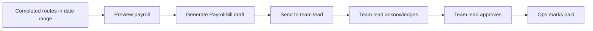

# Dynamic Payroll & Route Categories

## Overview

Payroll is calculated from **route category** (SMALL / MEDIUM / FULL) and configurable rates. Existing routes default to **SMALL**. The existing `PayrollBill` billing workflow is unchanged: `draft` → `pending_team_lead` → `team_lead_approved` → `paid`.

## Route categories

| Category | Default rate |
|----------|--------------|
| SMALL    | $200         |
| MEDIUM   | $300         |
| FULL     | $400         |

- Visible to: Admin, Dispatch Manager, Team Lead
- Hidden from: Driver
- Field: `routeCategory` on `Route` (default `SMALL`)

## Database

### Modified

- **routes** — `routeCategory` (enum, default `SMALL`, indexed)

### New collections

- **payrollsettings** — driver pay: `smallRouteRate`, `mediumRouteRate`, `fullRouteRate`, `updatedBy`
- **storebillingsettings** — warehouse→store billing: same rate fields (separate from driver pay)
- **payrollrouteadjustments** — per-route pay overrides (`originalAmount`, `adjustedAmount`, `reason`, `adjustedBy`)
- **payrollauditlogs** — rate changes, generation, adjustments, status changes

### Extended

- **payrollbills** — route lines include `routeCategory`, `defaultRate`, `originalAmount`, `hasAdjustment`; bill includes `subtotal`, `adjustmentsTotal`, `teamLeadAcknowledgedAt`

## Migration

```bash
npx ts-node scripts/migrations/001-route-category-payroll-foundation.ts
```

Backfills existing routes to `SMALL` and seeds default payroll settings.

## APIs

| Method | Path | Roles |
|--------|------|-------|
| GET | `/payroll/settings` | Admin, Dispatch Manager (driver pay rates) |
| PUT | `/payroll/settings` | Admin, Dispatch Manager |
| GET | `/payroll/store-billing-settings` | Admin, Dispatch Manager |
| PUT | `/payroll/store-billing-settings` | Admin, Dispatch Manager |
| GET | `/payroll/store-payroll/summary?search` | Admin, Dispatch Manager, Accountant, Team Lead |
| GET | `/payroll/store-payroll/stores/:storeId` | Admin, Dispatch Manager, Accountant, Team Lead |
| GET | `/payroll/preview?teamId&periodStart&periodEnd` | Admin, Dispatch Manager, Accountant |
| PUT | `/payroll/route-adjustments/:routeId` | Admin, Dispatch Manager |
| GET | `/payroll/audit-log` | Admin, Dispatch Manager |
| GET | `/payroll/reports/export` | Admin, Dispatch Manager, Accountant (CSV) |
| POST | `/payroll/bills/generate` | Admin, Dispatch Manager (+ `periodStart`, `periodEnd`) |
| POST | `/payroll/bills/:id/acknowledge` | Team Lead |

Existing bill endpoints (`send-to-team-lead`, `team-lead/approve`, `mark-paid`, etc.) unchanged.

## Calculation

```
routePay = adjustment.adjustedAmount ?? categoryRate[route.routeCategory]
driverPay = sum(routePay) + bonus + overtime - deduction
teamPay = sum(driverPay)
```

## Workflow



## QA checklist

- Existing routes → SMALL after migration
- Category CRUD + role visibility
- Settings validation (positive numbers)
- Date-range preview and generation
- Manual route pay override + audit log
- Acknowledge → approve → paid flow
- Notifications: generated, sent, approved
